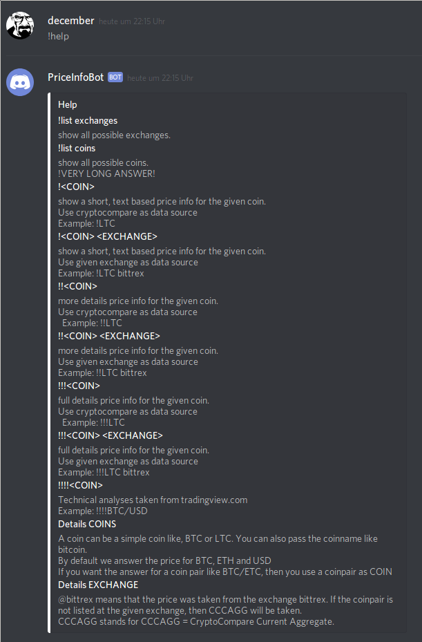
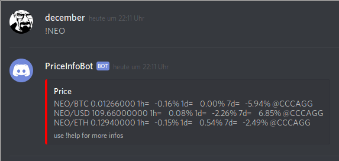
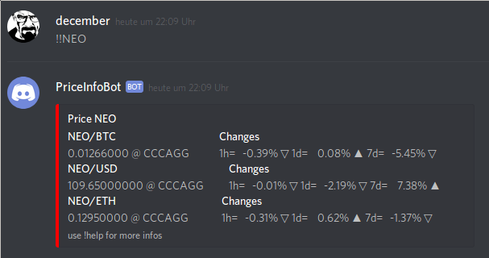
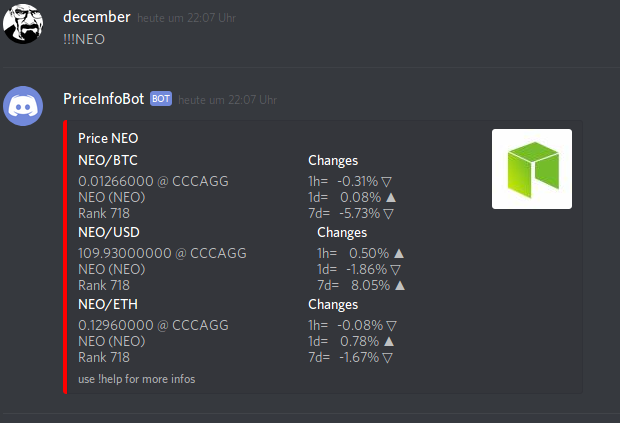

# discord_cryptocurrency_info_bot


copy secret.py and insert your discord key
```
cp secret_example.py secret.py
vi secret.py
```

start bot
```
python3 bot.py
```
Help



some examples






 
  


If you don't know how to add a bot to your discord server then you can take a look at this [Howto](https://github.com/reactiflux/discord-irc/wiki/Creating-a-discord-bot-&-getting-a-token)
